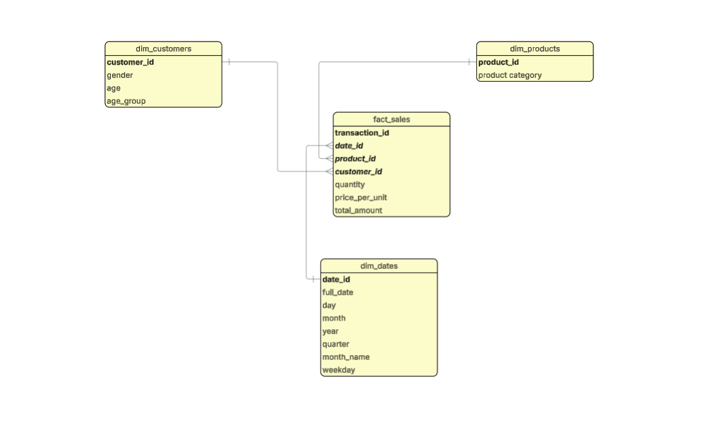

## Table Of Contents
  - [Introduction](#introduction)

  - [Dataset](#dataset)

  - [Support](#support)

## Introduction

In this project, I conducted a transactional sales analysis with an excel dataset sourced from Kaggle using SQL. 

### Objectives
The objectives of this project are as follows:
- Design a normalised relational data model
- Estimate revenue and analyse product performance
- Identify revenue drivers and discount effectiveness
- Present data-driven insights

## Dataset
The excel dataset was obtained from Kaggle. It consists of 1000 rows and 9 columns. In order to make use of the dataset, an ETL process has to take place from Excel to SQL Server Management Studio (SSMS). Firstly, I grouped the data into different tables and categorised into fact and dimension tables. The dataset includes the following tables:
- 'dim_customers' is a dimension table that contains customer information such as customer ID, gender, age and age group
- 'dim_products' is a dimension table that contains product details such product ID and product category
- 'dim_dates' is a dimension table that contains date_id, full date, day, month, year, quarter, month name, and week day
- 'fact_sales' is a facts table that contains transaction ID, date ID, product ID, customer ID, quantity, price per unit, and total amount.

To view the initial Excel dataset, click [here](https://github.com/mmustee/Retail-Sales-Analysis/tree/main/dataset)
## Support

If you have any queries, or suggestions, please connect with me on [LinkedIn](https://www.linkedin.com/in/mohammed-mustapha-ahmed-597a9a82/)
